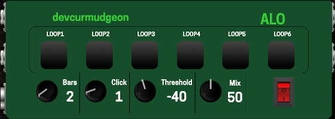

# Aloschen — transport-synced 3-track LV2 looper

ALOSCHEN is a lightweight, mistake-resistant looper that stays locked to the host transport.
It provides **3 independent loop slots**, each with **one-shot** record/overdub and **quantized undo**.

Tested on amd64 and aarch64 (MOD).



## Quick start

1. Start the host transport (this plugin is transport-synced; it does not free-run).
2. Set `Bars` (loop length = `Bars` bars).
3. Press `Loop1`/`Loop2`/`Loop3`:
   - If the slot is empty: arms base recording.
   - If the slot has audio: arms an overdub.
4. Recording starts **quantized** and lasts for exactly **one loop length**, then auto-stops.

## Looping behavior

Per slot:

- **Arm (base)**: Press `LoopN` when the slot is empty.
  - If this is the **first base recording in the instance** (no loop origin yet): starts on the **next Bars-cycle downbeat** (bar 1 beat 1 / step 0).
  - Otherwise: starts on the **next loop boundary** (phase-aligned with the existing loop origin).
- **Arm (overdub)**: Press `LoopN` when the slot already has audio.
  - Starts on the **next loop boundary**, records one loop length, then commits as a new overdub layer.
- **One-shot**: base and overdub both record for exactly one loop length and auto-stop.

### Undo

- Undo is **quantized** to the next **bar downbeat**.
- Press `UndoN` once: removes one overdub layer at the next bar.
- Press `UndoN` rapidly (2+ times before the next bar): clears the whole slot at the next bar.

### Bars changes (important)

Changing `Bars` is treated as a **blocking resync** (similar to disable/enable):

- The engine resets to guarantee transport/phase correctness.
- Existing loops/arms are cleared.

## Controls

Main controls:

- `Bars` (1..32, integer): loop length in bars.
- `Click` (0..10, integer): click volume (only when no loops are playing).
- `Mix` (0..100, integer): dry/wet blend.
- `ENABLED` (0/1): resets engine state on disable.

Per-slot buttons:

- `Loop1`, `Loop2`, `Loop3`: arm base/overdub.
- `Undo1`, `Undo2`, `Undo3`: quantized undo/clear.

Per-slot playback volumes:

- `loop1_vol`, `loop2_vol`, `loop3_vol` (0..1, float): playback gain coefficients.
  - Default `1.0` = unity gain (no change).
  - Applies to playback (base + overdub layers), not recording.

MIDI:

- `MIDI Base` sets the note mapping:
  - `MIDI Base + 0..2` → `Loop1..3`
  - `MIDI Base + 3..5` → `Undo1..3`

## Click + step indicator

- The click has three sounds:
  - **START**: bar 1 beat 1 of the Bars-length cycle (once per cycle)
  - **HIGH**: beat 1 of other bars
  - **LOW**: all other beats
- The DSP also outputs `bar_step` (index 20) as a step index across the Bars-length cycle:
  - steps = `Bars * 4` (4 steps per bar)
  - range is sized for `Bars` up to 32 (max 127)

## Build

From the repo root:

```sh
cd source
make -j
```

## Debug logging

Logging is opt-in:

```sh
ALO_LOG=1 <your-host>
tail -f /tmp/alo.log
```

## Notes

- The DSP preallocates all loop and overdub buffers at instantiate time (no allocation in the audio thread).
- Memory footprint is intentionally large (worst-case preallocation) to keep the audio thread deterministic.
